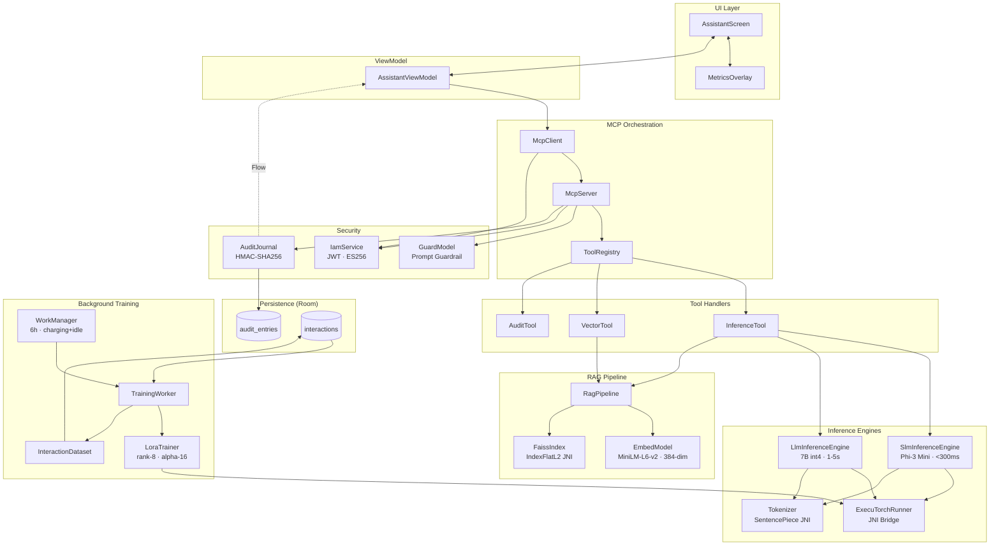
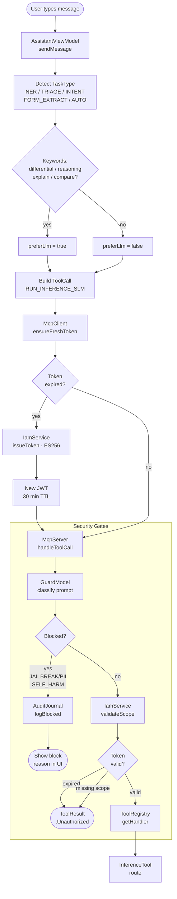
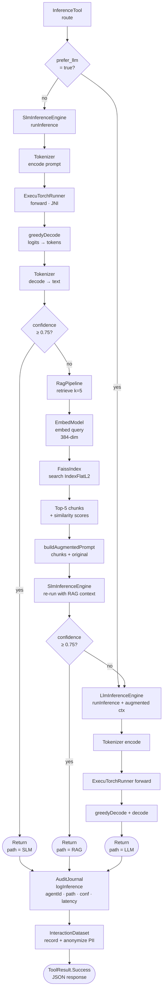
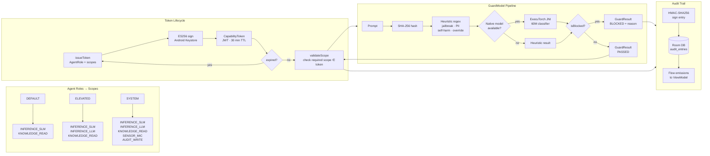
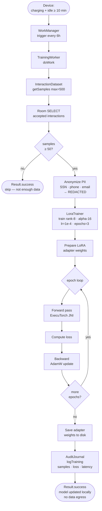
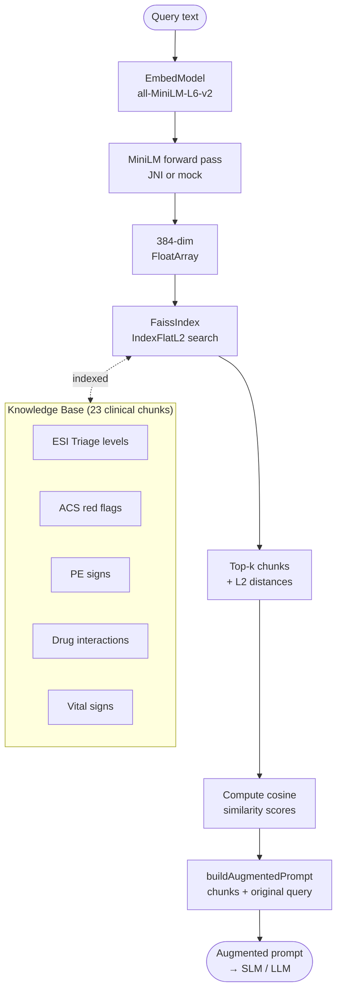

# EdgeMind — Flow Diagrams

## 1. System Architecture Flow

---

## 2. Message Processing Flow

---

## 3. Three-Path Inference Routing

---

## 4. Security & IAM Flow

---

## 5. Background Training Flow

---

## 6. RAG Pipeline Detail

