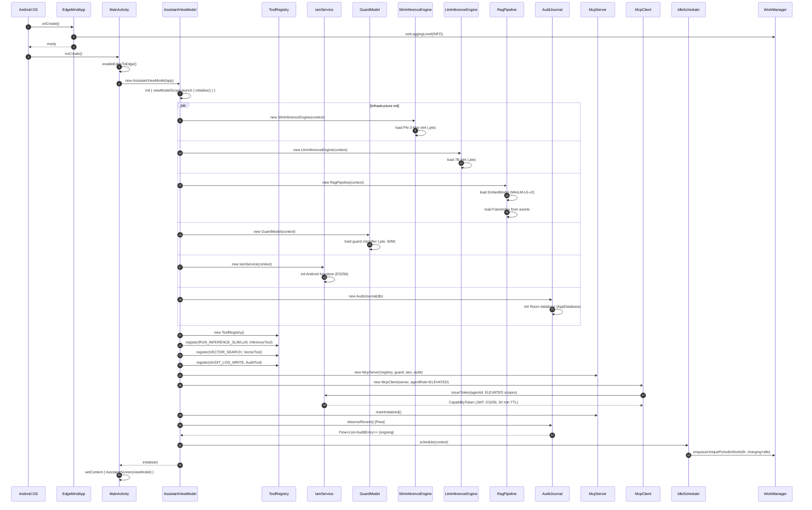
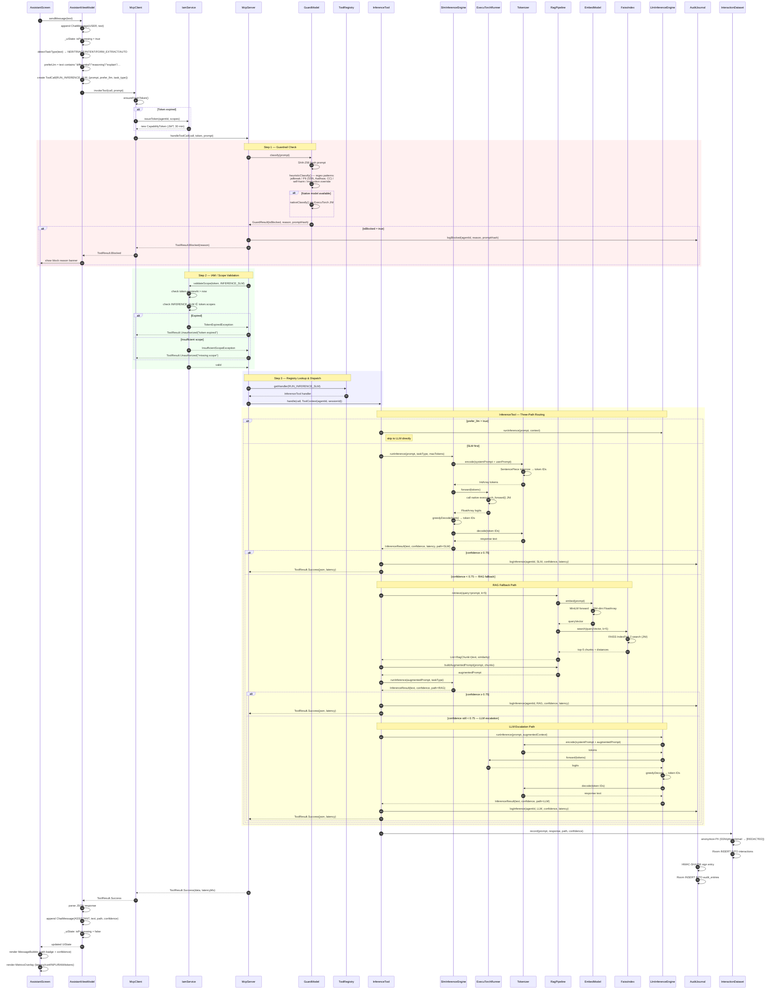
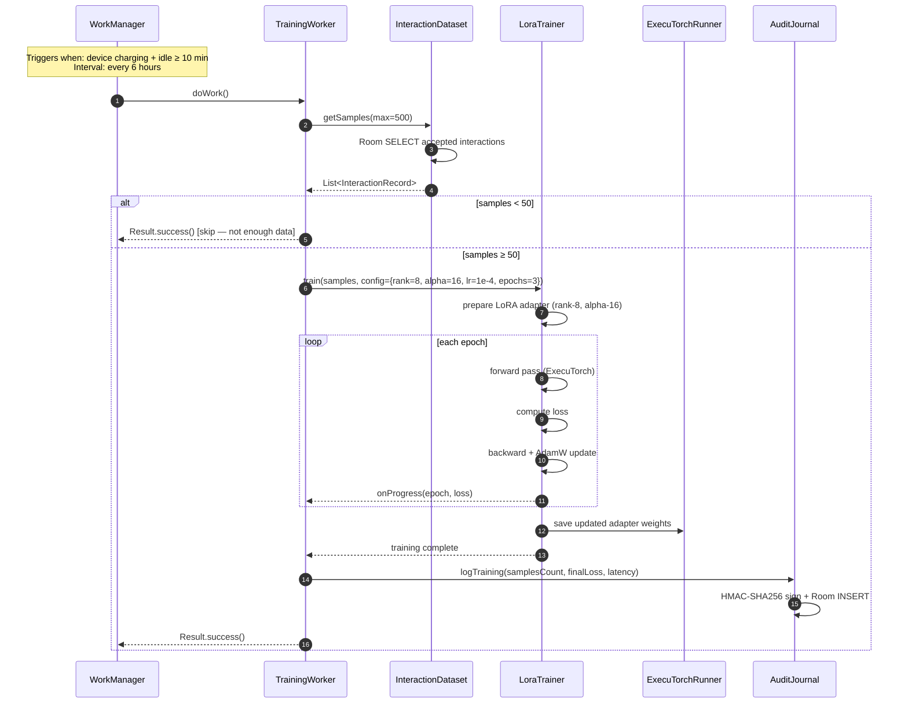
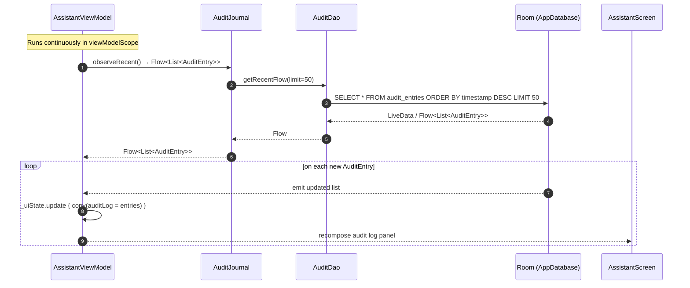
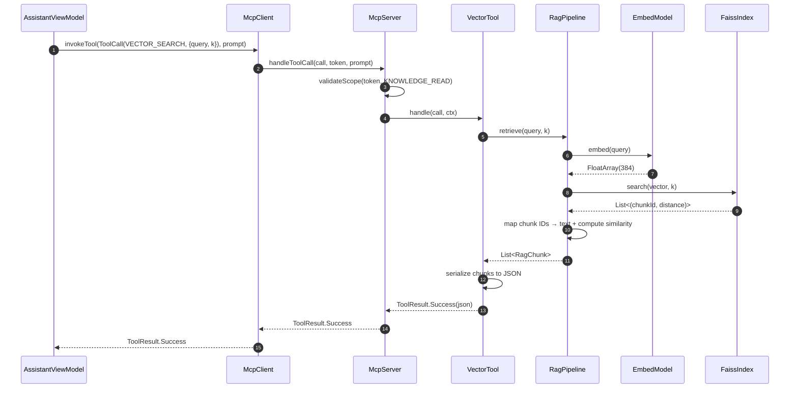

# EdgeMind — Complete Sequence Diagram

## 1. App Startup & Initialization



---

## 2. User Message — Main Processing Flow



---

## 3. Background Idle Training Flow



---

## 4. Audit Log Observation Flow (Reactive)



---

## 5. VectorSearch Tool Flow



---

## Architecture Overview (Component Map)

```
┌─────────────────────────────────────────────────────┐
│                    UI Layer                          │
│  AssistantScreen ◄──► AssistantViewModel             │
│  MetricsOverlay                                      │
└─────────────┬───────────────────────────────────────┘
              │
┌─────────────▼───────────────────────────────────────┐
│                  MCP Orchestration                   │
│  McpClient ──► McpServer ──► ToolRegistry            │
│                    │                                 │
│         ┌──────────┴──────────┐                      │
│         ▼                     ▼                      │
│    GuardModel             IamService                 │
└─────────┬────────────────────────────────────────────┘
          │
┌─────────▼────────────────────────────────────────────┐
│                  Tool Handlers                        │
│  InferenceTool   VectorTool   AuditTool              │
└──┬──────────┬──────────────────────────────────────┘
   │          │
   │    ┌─────▼──────────────────────┐
   │    │     RAG Pipeline           │
   │    │  EmbedModel + FaissIndex   │
   │    └────────────────────────────┘
   │
┌──▼──────────────────────────────────────────────────┐
│              Inference Engines                       │
│  SlmInferenceEngine (Phi-3 Mini, <300ms)            │
│  LlmInferenceEngine (7B int4, 1-5s)                 │
│  ExecuTorchRunner (JNI) + Tokenizer (JNI)           │
└─────────────────────────────────────────────────────┘

┌─────────────────────────────────────────────────────┐
│              Persistence & Training                  │
│  AuditJournal → Room (audit_entries)                │
│  InteractionDataset → Room (interactions)           │
│  LoraTrainer ← TrainingWorker ← WorkManager (6h)    │
└─────────────────────────────────────────────────────┘
```
