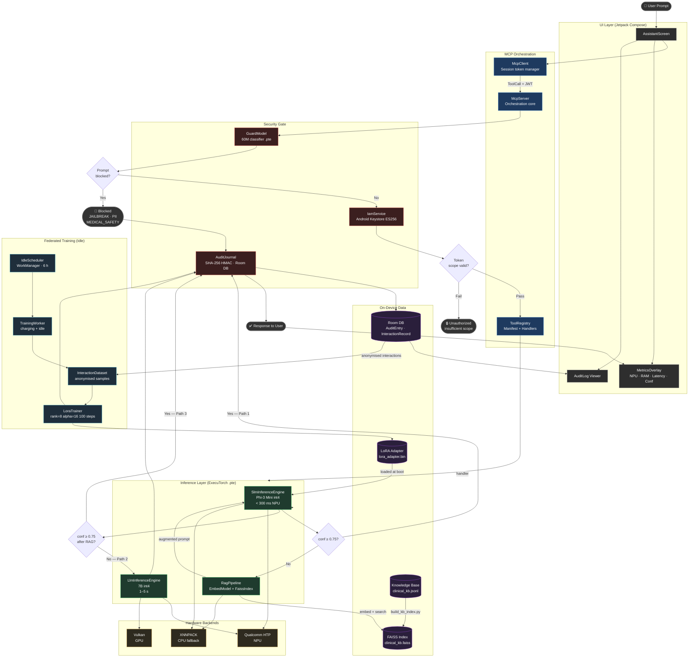

# EdgeMind — Flow Diagram

```mermaid
flowchart TD
    %% ── Entry ────────────────────────────────────────────────────────────
    USER([👤 User Prompt])

    %% ── UI Layer ─────────────────────────────────────────────────────────
    subgraph UI["UI Layer (Jetpack Compose)"]
        SCREEN[AssistantScreen]
        METRICS[MetricsOverlay\nNPU · RAM · Latency · Conf]
        AUDITUI[AuditLog Viewer]
    end

    %% ── MCP Orchestration ────────────────────────────────────────────────
    subgraph MCP["MCP Orchestration"]
        CLIENT[McpClient\nSession token manager]
        SERVER[McpServer\nOrchestration core]
        REGISTRY[ToolRegistry\nManifest + Handlers]
    end

    %% ── Security Gate ────────────────────────────────────────────────────
    subgraph SEC["Security Gate"]
        GUARD[GuardModel\n60M classifier .pte]
        IAM[IamService\nAndroid Keystore ES256]
        AUDIT[AuditJournal\nSHA-256 HMAC · Room DB]
    end

    %% ── Guard decisions ──────────────────────────────────────────────────
    BLOCK_CHECK{Prompt\nblocked?}
    SCOPE_CHECK{Token\nscope valid?}

    %% ── Inference Layer ──────────────────────────────────────────────────
    subgraph INF["Inference Layer (ExecuTorch .pte)"]
        SLM[SlmInferenceEngine\nPhi-3 Mini int4\n< 300 ms NPU]
        RAG_PIPE[RagPipeline\nEmbedModel + FaissIndex]
        LLM[LlmInferenceEngine\n7B int4\n1–5 s]
    end

    %% ── Confidence routing ───────────────────────────────────────────────
    CONF1{conf ≥ 0.75?}
    CONF2{conf ≥ 0.75\nafter RAG?}

    %% ── Hardware backends ────────────────────────────────────────────────
    subgraph HW["Hardware Backends"]
        HTP[Qualcomm HTP\nNPU]
        XNNPACK[XNNPACK\nCPU fallback]
        VULKAN[Vulkan\nGPU]
    end

    %% ── Data layer ───────────────────────────────────────────────────────
    subgraph DATA["On-Device Data"]
        ROOM[(Room DB\nAuditEntry · InteractionRecord)]
        FAISS[(FAISS Index\nclinical_kb.faiss)]
        KB[(Knowledge Base\nclinical_kb.jsonl)]
        ADAPTER[(LoRA Adapter\nlora_adapter.bin)]
    end

    %% ── Training loop ────────────────────────────────────────────────────
    subgraph TRAIN["Federated Training (Idle)"]
        SCHED[IdleScheduler\nWorkManager · 6 h]
        WORKER[TrainingWorker\ncharging + idle]
        DATASET[InteractionDataset\nanonymised samples]
        LORA[LoraTrainer\nrank=8 alpha=16 100 steps]
    end

    %% ── Block reasons ────────────────────────────────────────────────────
    BLOCKED_OUT([🚫 Blocked\nJAILBREAK · PII\nMEDICAL_SAFETY])
    UNAUTH_OUT([🔒 Unauthorized\ninsufficient scope])
    RESPONSE([✅ Response to User])

    %% ── Edges: UI → MCP ──────────────────────────────────────────────────
    USER --> SCREEN
    SCREEN --> CLIENT
    SCREEN --> METRICS
    SCREEN --> AUDITUI

    %% ── MCP internal ─────────────────────────────────────────────────────
    CLIENT -->|ToolCall + JWT| SERVER
    SERVER --> GUARD
    GUARD --> BLOCK_CHECK

    BLOCK_CHECK -->|Yes| BLOCKED_OUT
    BLOCK_CHECK -->|No| IAM
    BLOCKED_OUT --> AUDIT

    IAM --> SCOPE_CHECK
    SCOPE_CHECK -->|Fail| UNAUTH_OUT
    SCOPE_CHECK -->|Pass| REGISTRY
    REGISTRY -->|handler| INF

    %% ── Inference routing ────────────────────────────────────────────────
    INF --> SLM
    SLM --> CONF1

    CONF1 -->|Yes — Path 1| AUDIT
    CONF1 -->|No| RAG_PIPE

    RAG_PIPE -->|embed + search| FAISS
    RAG_PIPE -->|augmented prompt| SLM
    SLM --> CONF2

    CONF2 -->|Yes — Path 3| AUDIT
    CONF2 -->|No — Path 2| LLM
    LLM --> AUDIT

    %% ── Audit → DB ───────────────────────────────────────────────────────
    AUDIT --> ROOM
    ROOM --> AUDITUI

    %% ── Response back to UI ──────────────────────────────────────────────
    AUDIT --> RESPONSE
    RESPONSE --> METRICS

    %% ── Hardware wiring ──────────────────────────────────────────────────
    SLM --> HTP
    SLM --> XNNPACK
    LLM --> HTP
    LLM --> VULKAN
    RAG_PIPE --> XNNPACK

    %% ── Data wiring ──────────────────────────────────────────────────────
    KB -->|build_kb_index.py| FAISS
    ADAPTER -->|loaded at boot| SLM

    %% ── Training loop ────────────────────────────────────────────────────
    SCHED --> WORKER
    WORKER --> DATASET
    DATASET --> LORA
    LORA --> ADAPTER
    ROOM -->|anonymised interactions| DATASET
    LORA --> AUDIT

    %% ── Styling ──────────────────────────────────────────────────────────
    classDef mcpNode    fill:#1e3a5f,stroke:#4a90d9,color:#fff
    classDef secNode    fill:#3b1f1f,stroke:#d94a4a,color:#fff
    classDef infNode    fill:#1f3b2e,stroke:#4ad97a,color:#fff
    classDef hwNode     fill:#2e2a1f,stroke:#d9a84a,color:#fff
    classDef dataNode   fill:#2a1f3b,stroke:#9a4ad9,color:#fff
    classDef trainNode  fill:#1f2e3b,stroke:#4ab8d9,color:#fff
    classDef uiNode     fill:#2e2e2e,stroke:#aaa,color:#fff
    classDef terminal   fill:#333,stroke:#888,color:#eee,rx:20

    class CLIENT,SERVER,REGISTRY mcpNode
    class GUARD,IAM,AUDIT secNode
    class SLM,RAG_PIPE,LLM infNode
    class HTP,XNNPACK,VULKAN hwNode
    class ROOM,FAISS,KB,ADAPTER dataNode
    class SCHED,WORKER,DATASET,LORA trainNode
    class SCREEN,METRICS,AUDITUI uiNode
    class USER,BLOCKED_OUT,UNAUTH_OUT,RESPONSE terminal
```
