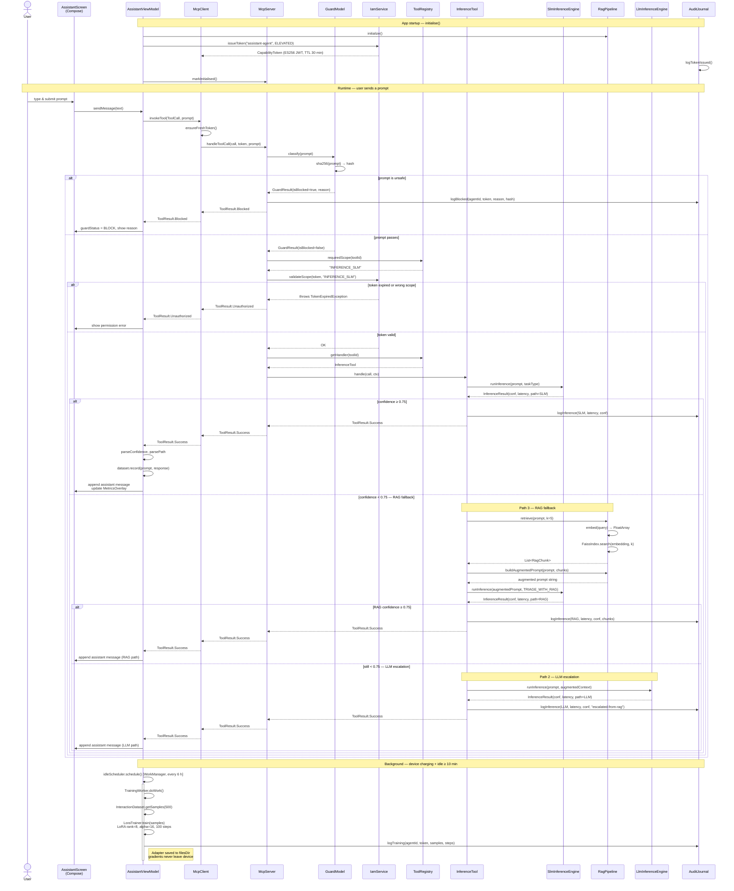

# EdgeMind — Sequence Diagram

```mermaid
sequenceDiagram
    actor User
    participant UI as AssistantScreen<br/>(Compose)
    participant VM as AssistantViewModel
    participant Client as McpClient
    participant Server as McpServer
    participant Guard as GuardModel
    participant IAM as IamService
    participant Registry as ToolRegistry
    participant Tool as InferenceTool
    participant SLM as SlmInferenceEngine
    participant RAG as RagPipeline
    participant LLM as LlmInferenceEngine
    participant Audit as AuditJournal

    %% ── Boot ──────────────────────────────────────────────────────────────
    Note over VM,Audit: App startup — initialise()
    VM->>RAG: initialize()
    VM->>IAM: issueToken("assistant-agent", ELEVATED)
    IAM-->>Client: CapabilityToken (ES256 JWT, TTL 30 min)
    Audit->>Audit: logTokenIssued()
    VM->>Server: markInitialised()

    %% ── Happy path: prompt → SLM ──────────────────────────────────────────
    Note over User,Audit: Runtime — user sends a prompt
    User->>UI: type & submit prompt
    UI->>VM: sendMessage(text)
    VM->>Client: invokeTool(ToolCall, prompt)
    Client->>Client: ensureFreshToken()
    Client->>Server: handleToolCall(call, token, prompt)

    %% Guard
    Server->>Guard: classify(prompt)
    Guard->>Guard: sha256(prompt) → hash
    alt prompt is unsafe
        Guard-->>Server: GuardResult(isBlocked=true, reason)
        Server->>Audit: logBlocked(agentId, token, reason, hash)
        Server-->>Client: ToolResult.Blocked
        Client-->>VM: ToolResult.Blocked
        VM->>UI: guardStatus = BLOCK, show reason
    else prompt passes
        Guard-->>Server: GuardResult(isBlocked=false)

        %% IAM
        Server->>Registry: requiredScope(toolId)
        Registry-->>Server: "INFERENCE_SLM"
        Server->>IAM: validateScope(token, "INFERENCE_SLM")
        alt token expired or wrong scope
            IAM-->>Server: throws TokenExpiredException
            Server-->>Client: ToolResult.Unauthorized
            Client-->>VM: ToolResult.Unauthorized
            VM->>UI: show permission error
        else token valid
            IAM-->>Server: OK

            %% Route to tool
            Server->>Registry: getHandler(toolId)
            Registry-->>Server: InferenceTool
            Server->>Tool: handle(call, ctx)

            %% Path 1 — SLM
            Tool->>SLM: runInference(prompt, taskType)
            SLM-->>Tool: InferenceResult(conf, latency, path=SLM)

            alt confidence ≥ 0.75
                Tool->>Audit: logInference(SLM, latency, conf)
                Tool-->>Server: ToolResult.Success
                Server-->>Client: ToolResult.Success
                Client-->>VM: ToolResult.Success
                VM->>VM: parseConfidence, parsePath
                VM->>VM: dataset.record(prompt, response)
                VM->>UI: append assistant message<br/>update MetricsOverlay

            else confidence < 0.75 — RAG fallback
                %% Path 3 — RAG
                Note over Tool,RAG: Path 3 — RAG fallback
                Tool->>RAG: retrieve(prompt, k=5)
                RAG->>RAG: embed(query) → FloatArray
                RAG->>RAG: FaissIndex.search(embedding, k)
                RAG-->>Tool: List<RagChunk>
                Tool->>RAG: buildAugmentedPrompt(prompt, chunks)
                RAG-->>Tool: augmented prompt string
                Tool->>SLM: runInference(augmentedPrompt, TRIAGE_WITH_RAG)
                SLM-->>Tool: InferenceResult(conf, latency, path=RAG)

                alt RAG confidence ≥ 0.75
                    Tool->>Audit: logInference(RAG, latency, conf, chunks)
                    Tool-->>Server: ToolResult.Success
                    Server-->>Client: ToolResult.Success
                    Client-->>VM: ToolResult.Success
                    VM->>UI: append assistant message (RAG path)

                else still < 0.75 — LLM escalation
                    %% Path 2 — LLM
                    Note over Tool,LLM: Path 2 — LLM escalation
                    Tool->>LLM: runInference(prompt, augmentedContext)
                    LLM-->>Tool: InferenceResult(conf, latency, path=LLM)
                    Tool->>Audit: logInference(LLM, latency, conf, "escalated-from-rag")
                    Tool-->>Server: ToolResult.Success
                    Server-->>Client: ToolResult.Success
                    Client-->>VM: ToolResult.Success
                    VM->>UI: append assistant message (LLM path)
                end
            end
        end
    end

    %% ── Idle training loop ────────────────────────────────────────────────
    Note over VM,Audit: Background — device charging + idle ≥ 10 min
    VM->>VM: idleScheduler.schedule() [WorkManager, every 6 h]
    activate VM
    VM->>VM: TrainingWorker.doWork()
    VM->>VM: InteractionDataset.getSamples(500)
    VM->>VM: LoraTrainer.train(samples)<br/>LoRA rank=8, alpha=16, 100 steps
    VM->>Audit: logTraining(agentId, token, samples, steps)
    Note right of VM: Adapter saved to filesDir<br/>gradients never leave device
    deactivate VM
```
